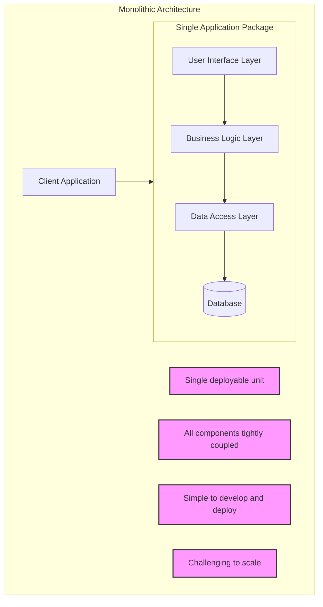
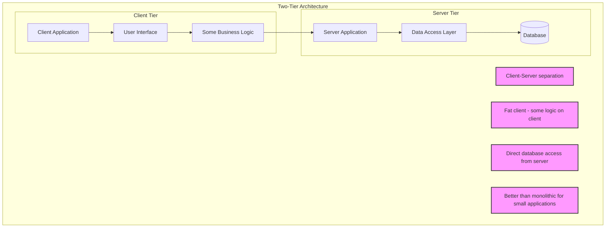
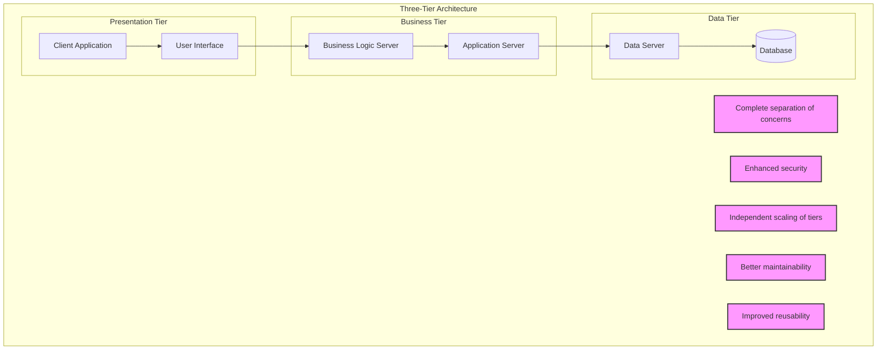
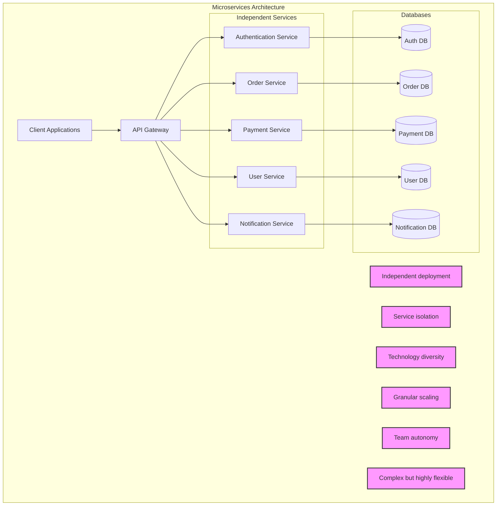

```mermaid
graph TD
    subgraph "Monolithic Architecture"
        Client[Client Application] --> Monolith
        
        subgraph Monolith[Single Application Package]
            UI[User Interface Layer]
            BL[Business Logic Layer]
            DAL[Data Access Layer]
            DB[(Database)]
            
            UI --> BL
            BL --> DAL
            DAL --> DB
        end
        
        note1[Single deployable unit]
        note2[All components tightly coupled]
        note3[Simple to develop and deploy]
        note4[Challenging to scale]
        
        class note1,note2,note3,note4 note
    end

classDef note fill:#f9f,stroke:#333,stroke-width:2px
```
---

```mermaid
graph TD
    subgraph "Two-Tier Architecture"
        subgraph "Client Tier"
            C1[Client Application]
            UI1[User Interface]
            BL1[Some Business Logic]
            C1 --> UI1
            UI1 --> BL1
        end

        subgraph "Server Tier"
            S1[Server Application]
            DAL1[Data Access Layer]
            DB1[(Database)]
            S1 --> DAL1
            DAL1 --> DB1
        end

        BL1 --> S1

        note1[Client-Server separation]
        note2[Fat client - some logic on client]
        note3[Direct database access from server]
        note4[Better than monolithic for small applications]

        class note1,note2,note3,note4 note
    end

classDef note fill:#f9f,stroke:#333,stroke-width:2px
```
---

```mermaid
graph TD
    subgraph "Three-Tier Architecture"
        subgraph "Presentation Tier"
            C2[Client Application]
            UI2[User Interface]
            C2 --> UI2
        end

        subgraph "Business Tier"
            BL2[Business Logic Server]
            AS2[Application Server]
            BL2 --> AS2
        end

        subgraph "Data Tier"
            DS2[Data Server]
            DB2[(Database)]
            DS2 --> DB2
        end

        UI2 --> BL2
        AS2 --> DS2

        note1[Complete separation of concerns]
        note2[Enhanced security]
        note3[Independent scaling of tiers]
        note4[Better maintainability]
        note5[Improved reusability]

        class note1,note2,note3,note4,note5 note
    end

classDef note fill:#f9f,stroke:#333,stroke-width:2px
```
---

```mermaid
graph TD
    subgraph "Microservices Architecture"
        Client3[Client Applications]
        API[API Gateway]
        
        subgraph "Independent Services"
            Auth[Authentication Service]
            Order[Order Service]
            Payment[Payment Service]
            User[User Service]
            Notification[Notification Service]
        end
        
        subgraph "Databases"
            AuthDB[(Auth DB)]
            OrderDB[(Order DB)]
            PayDB[(Payment DB)]
            UserDB[(User DB)]
            NotifyDB[(Notification DB)]
        end
        
        Client3 --> API
        API --> Auth
        API --> Order
        API --> Payment
        API --> User
        API --> Notification
        
        Auth --> AuthDB
        Order --> OrderDB
        Payment --> PayDB
        User --> UserDB
        Notification --> NotifyDB
        
        note1[Independent deployment]
        note2[Service isolation]
        note3[Technology diversity]
        note4[Granular scaling]
        note5[Team autonomy]
        note6[Complex but highly flexible]
        
        class note1,note2,note3,note4,note5,note6 note
    end

classDef note fill:#f9f,stroke:#333,stroke-width:2px
```
