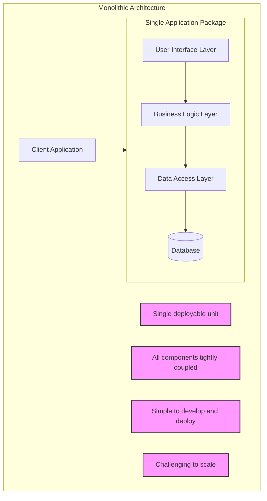

```mermaid
graph TD
    subgraph "Monolithic Architecture"
        Client[Client Application] --> Monolith
        
        subgraph Monolith[Single Application Package]
            UI[User Interface Layer]
            BL[Business Logic Layer]
            DAL[Data Access Layer]
            DB[(Database)]
            
            UI --> BL
            BL --> DAL
            DAL --> DB
        end
        
        note1[Single deployable unit]
        note2[All components tightly coupled]
        note3[Simple to develop and deploy]
        note4[Challenging to scale]
        
        class note1,note2,note3,note4 note
    end

classDef note fill:#f9f,stroke:#333,stroke-width:2px
```
