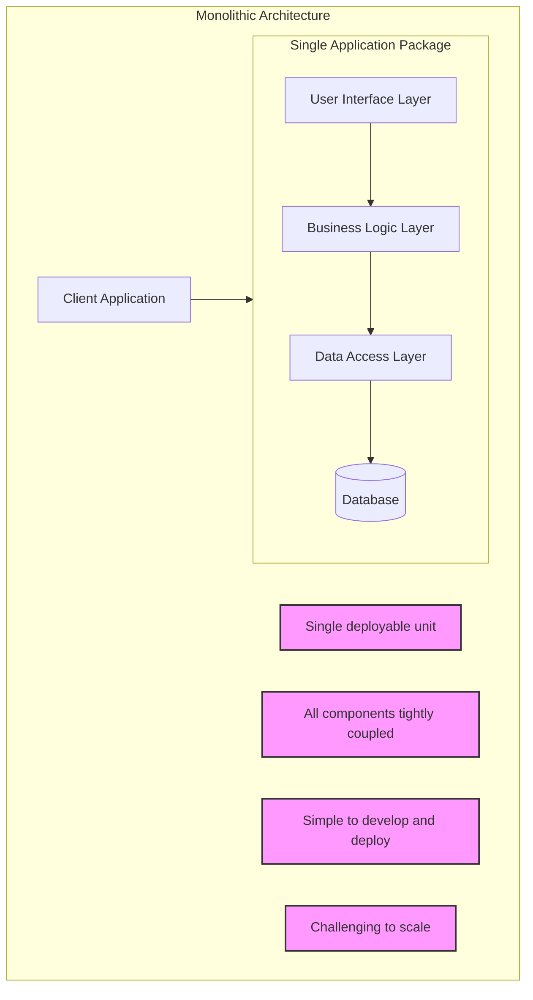
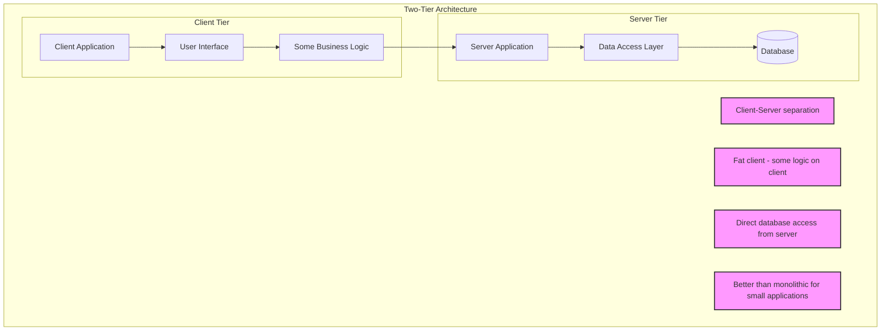

```mermaid
graph TD
    subgraph "Monolithic Architecture"
        Client[Client Application] --> Monolith
        
        subgraph Monolith[Single Application Package]
            UI[User Interface Layer]
            BL[Business Logic Layer]
            DAL[Data Access Layer]
            DB[(Database)]
            
            UI --> BL
            BL --> DAL
            DAL --> DB
        end
        
        note1[Single deployable unit]
        note2[All components tightly coupled]
        note3[Simple to develop and deploy]
        note4[Challenging to scale]
        
        class note1,note2,note3,note4 note
    end

classDef note fill:#f9f,stroke:#333,stroke-width:2px
```
---

```mermaid
graph TD
    subgraph "Two-Tier Architecture"
        subgraph "Client Tier"
            C1[Client Application]
            UI1[User Interface]
            BL1[Some Business Logic]
            C1 --> UI1
            UI1 --> BL1
        end

        subgraph "Server Tier"
            S1[Server Application]
            DAL1[Data Access Layer]
            DB1[(Database)]
            S1 --> DAL1
            DAL1 --> DB1
        end

        BL1 --> S1

        note1[Client-Server separation]
        note2[Fat client - some logic on client]
        note3[Direct database access from server]
        note4[Better than monolithic for small applications]

        class note1,note2,note3,note4 note
    end

classDef note fill:#f9f,stroke:#333,stroke-width:2px
```
