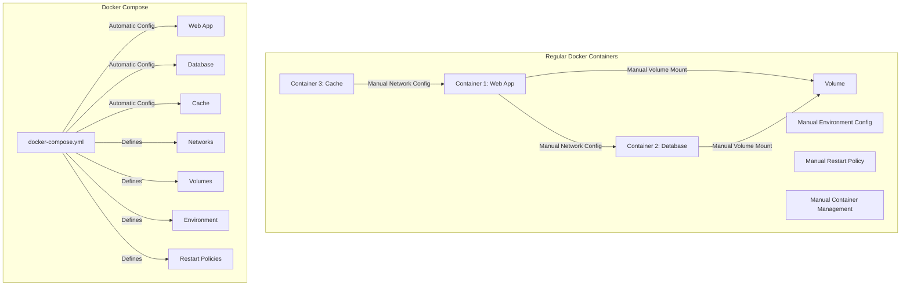

---

### Key Advantages of Docker Compose:

#### 1. Simplified Configuration Management:

- Single YAML file defines entire application stack
- Easy to version control and share configurations
- Consistent environment setup across development and production

#### 2. Automated Container Management:

- Start/stop multiple containers with a single command
- Automatic network creation and linking
- Built-in dependency management between services

#### 3. Simplified Networking:
- Automatic network creation
- Service discovery using container names
- Easier port management
